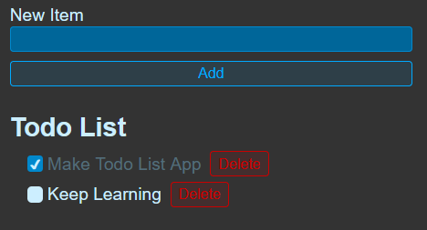

# Todo List App

Learning basics of react by making this Todo List app, we can enter any task we want to keep track and check it once we complete it or delete it from list. The app can also be refreshed and data will persist through.

I covered components, state, use effect, different hooks and different topics from beginner to more intermediate concepts.
